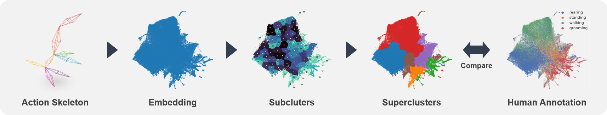

# SUBTLE framework 

SUBTLE automates the tasks of both identifying behavioral repertoires such as walking, grooming, standing, and rearing from freely moving mice. Our framework utilizes __Spectrogram-UMAP-based Temporal Link Embedding (SUBTLE)__ which effectively reflects both temporal and kinematic representation in the behavioral embedding space. From this embeding space, we create subclusters as behavioral states, which serve as building blocks for identifying superclusters as behavioral repertoires. For more details, see our [paper](#).
# Website
Check out our [website](https://ibs.re.kr/subtle) for more information and a GUI web page for SUBTLE framework.
## Rearing-like behavior repertoires (supercluster 0)

## Grooming-like behavior repertoires (supercluster 1, 2)

## Walking-like behavior repertoires (supercluster 3)

## Standing-like behavior repertoires (supercluster 4,5)

# Installation
```
pip install -U git+https://github.com/jeakwon/subtle.git
```
or
```
pip install -U https://github.com/jeakwon/subtle/archive/refs/heads/main.zip
```

# Datasets
Access our (3d action skeleton datasets)[https://github.com/jeakwon/subtle/tree/main/dataset]. 
- List of files : 19 action skeleton recordings 10 human annotations
- Frame length : ~12,000 frames
- Sampling rate : 20 fps
- Recording time : ~10 minutes
- Recording system : AVATAR system [paper@biorxiv](https://www.biorxiv.org/content/10.1101/2021.12.31.474634v1), [poster@cv4animals](https://www.cv4animals.com/2022-accepted-papers)
- Annotated labels : walking, rearing, standing, grooming, na (not assigned)

# Quick Demo
You can try simple demonstration in [colab](https://github.com/jeakwon/subtle/blob/main/subtle_demo.ipynb)
## Prepare dataset
```python
import subtle
import pandas as pd

# Dataset for training (5 young 5 adult mice)
y5a5 = [
    'https://raw.githubusercontent.com/jeakwon/subtle/main/dataset/y5a5/coords/adult_6112.csv',
    'https://raw.githubusercontent.com/jeakwon/subtle/main/dataset/y5a5/coords/adult_6115.csv',
    'https://raw.githubusercontent.com/jeakwon/subtle/main/dataset/y5a5/coords/adult_6116.csv',
    'https://raw.githubusercontent.com/jeakwon/subtle/main/dataset/y5a5/coords/adult_6127.csv',
    'https://raw.githubusercontent.com/jeakwon/subtle/main/dataset/y5a5/coords/adult_7678.csv',
    'https://raw.githubusercontent.com/jeakwon/subtle/main/dataset/y5a5/coords/young_7100.csv',
    'https://raw.githubusercontent.com/jeakwon/subtle/main/dataset/y5a5/coords/young_7678.csv',
    'https://raw.githubusercontent.com/jeakwon/subtle/main/dataset/y5a5/coords/young_8294.csv',
    'https://raw.githubusercontent.com/jeakwon/subtle/main/dataset/y5a5/coords/young_8296.csv',
    'https://raw.githubusercontent.com/jeakwon/subtle/main/dataset/y5a5/coords/young_8301.csv',
]

# Dataset for mapping (3 young 6 adult mice)
y3a6 = [
    'https://raw.githubusercontent.com/jeakwon/subtle/main/dataset/y3a6/coords/adult_8294.csv',
    'https://raw.githubusercontent.com/jeakwon/subtle/main/dataset/y3a6/coords/adult_8296.csv',
    'https://raw.githubusercontent.com/jeakwon/subtle/main/dataset/y3a6/coords/adult_8301.csv',
    'https://raw.githubusercontent.com/jeakwon/subtle/main/dataset/y3a6/coords/adult_8765.csv',
    'https://raw.githubusercontent.com/jeakwon/subtle/main/dataset/y3a6/coords/adult_8767.csv',
    'https://raw.githubusercontent.com/jeakwon/subtle/main/dataset/y3a6/coords/adult_8789.csv',
    'https://raw.githubusercontent.com/jeakwon/subtle/main/dataset/y3a6/coords/young_8765.csv',
    'https://raw.githubusercontent.com/jeakwon/subtle/main/dataset/y3a6/coords/young_8767.csv',
    'https://raw.githubusercontent.com/jeakwon/subtle/main/dataset/y3a6/coords/young_8789.csv',
]

training_dataset = []
training_nameset = []
for csv in y5a5:
    X = pd.read_csv(csv, header=None).values
    X = subtle.avatar_preprocess(X) # subtract coordinates with global mean of (x, y, z)
    training_dataset.append(X)

    training_name = csv.split('/')[-1].replace('.csv', '')
    training_nameset.append(training_name)
    

mapping_dataset = []
mapping_nameset = []
for csv in y3a6:
    X = pd.read_csv(csv, header=None).values
    X = subtle.avatar_preprocess(X) # subtract coordinates with global mean of (x, y, z)
    mapping_dataset.append(X)

    mapping_name = csv.split('/')[-1].replace('.csv', '')
    mapping_nameset.append(mapping_name)
    
```

## Training and Mapping
```python
mapper = subtle.Mapper(fs=20) # fs, sampling frequency
training_outputs = mapper.fit(training_dataset)
mapping_outputs = mapper.run(mapping_dataset)
```

## Save and Load trained model
```python
mapper.save('trained_model.pkl')
mapper = subtle.load('trained_model.pkl')
```

### Save output result into csv files
```python
for name, output in zip(training_nameset, training_outputs):

    # export embeddings
    df = pd.DataFrame(output.Z)
    df.to_csv(name+'_embeddings.csv', header=None, index=None)

    # export subclusters
    df = pd.DataFrame(output.y)
    df.to_csv(name+'_subclusters.csv', header=None, index=None)

    # export superclusters
    df = pd.DataFrame(output.Y)
    df.to_csv(name+'_superclusters.csv', header=None, index=None)

    # export transition probabilities
    df = pd.DataFrame(output.TP)
    df.to_csv(name+'transition_probabilities.csv', header=None, index=None)

    # export retention rate
    df = pd.DataFrame(output.R)
    df.to_csv(name+'retention_rate.csv', header=None, index=None)

```

## Visualize trained result
```python

import matplotlib.pyplot as plt

fig, ax = plt.subplots(1, 2, figsize=(10, 5))
ax[0].scatter(mapper.Z[:, 0], mapper.Z[:, 1], s=1, c=mapper.y) # subclusters
ax[1].scatter(mapper.Z[:, 0], mapper.Z[:, 1], s=1, c=mapper.Y[:, -1]) # superclusters
```
